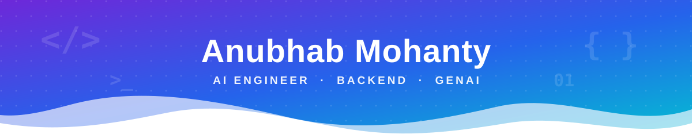
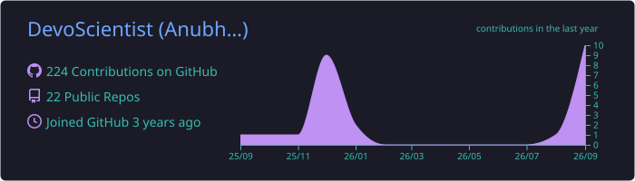
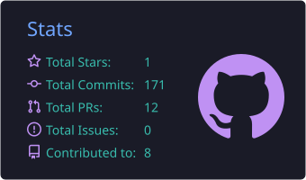
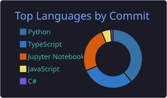

<p align="center">
  
</p>

<p align="center">
  
</p>

<p align="center">
  <a href="https://www.linkedin.com/in/anubhab-mohanty-a61738138/"></a>
  <a href="https://x.com/anubhab13rta"></a>
  <a href="https://www.twitch.tv/devoscientist"></a>
  <a href="https://github.com/DevoScientist"></a>
</p>

<br>

<h2 align="center">👋 About Me</h2>

| 🧠 Role | ⚙️ Building | 🔭 Exploring | 🤝 Open to Collab |
| :---: | :---: | :---: | :---: |
| **AI Engineer** shipping AI-first products across backend, GenAI & data engineering | Backend systems & APIs with **Python, FastAPI & Pydantic** | Low-level programming, **C++**, machine architecture, Next.js & Spring Boot | **Python, Rust, C++ & C** |

<p align="center">
  💬 Ask me about <b>Agentic AI</b> &nbsp;·&nbsp; <b>GenAI</b> &nbsp;·&nbsp; <b>ML</b> &nbsp;·&nbsp; <b>DL</b>
  <br>
  🔥 Driven by <b>Egoista</b>, an unshakable drive to win &nbsp;·&nbsp; 🎯 <i>Ship value fast. Iterate smarter.</i>
</p>

<br>

<h2 align="center">💻 Tech Stack</h2>

| Domain | Stack |
| :--- | :--- |
| **Languages** |     |
| **Backend & APIs** |      |
| **Frontend** |   |
| **AI & GenAI** |         |
| **Data Engineering** |        |
| **Databases** |     |
| **Tools & Platforms** |            |

<br>

<h2 align="center">📊 GitHub Stats</h2>

<p align="center">
  
</p>

<p align="center">
  
  
</p>

<br>

<h2 align="center">>_ Terminal Session</h2>

```bash
user@devoscientist:~$ whoami
AI engineer | low-level dreamer | system builder

user@devoscientist:~$ uptime
still just getting started...
```

<p align="center">
  <i>The shell never judges… but it does silently mock every typo.</i>
</p>

<p align="center">
  
</p>

